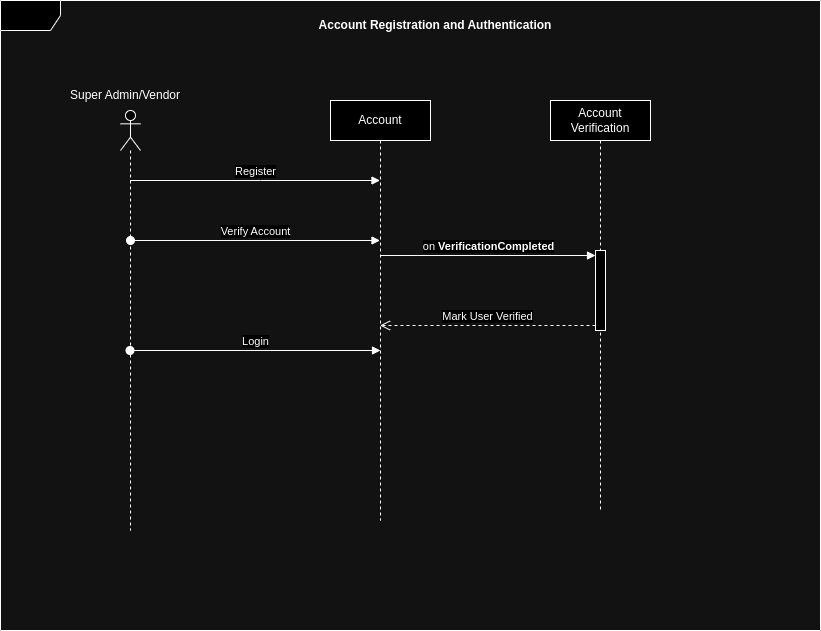
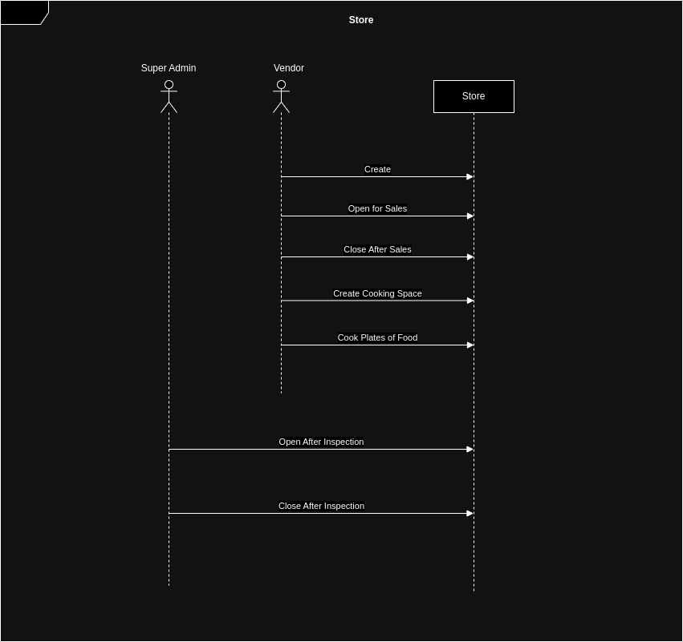
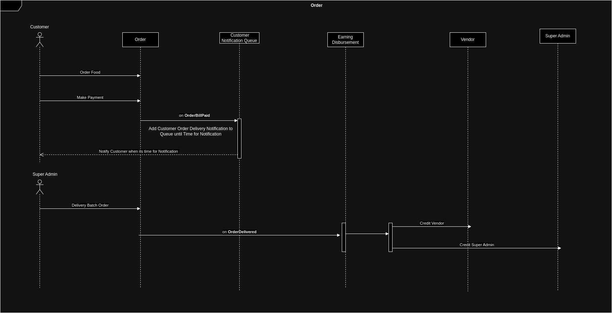
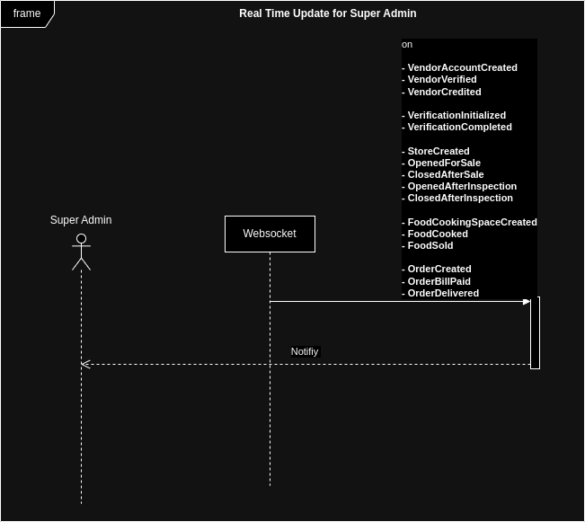

---

## How to Run

### Requirements
 - Port 8089 should be free
 - Docker

On Linux/Mac
```bash
make app-dev-run
```

On windows
```bash
docker compose -f devops/dev/docker-compose.yml -p food-ordering up
```

### Swagger API docs
```
http://localhost:8089/docs
```

---

### Project Structure
- `.github`: For automated testing in github CI/CD.
- `devops.dev`: docker files for running app on development (non-production) mode.
- `devops.local-dev`: docker files for local development.
- `devops.test`: docker files for testing application.
- `src.app`: This is where operation in the application originates from. The operations can be triggered internally or externally (ie: users make requests). This folder contains controllers (for http routes, websocket), job scheduler (using queue), event handlers 
- `src.domain`: This is where domain objects lives. Contains majority of the app business logic. Domain Objects includes: aggregates, domain events, value objects, domain services, entities.
- `src.lib`: This is where utility functions lives.
- `src.presistence`: This is where repositories and cache for data storage lives.
- `src.validator`: This is where value validators used by domain objects and dtos lives
- `test.integration`: Integration test, app is set up to run similar way in production, and API calls are made, response are being asserted. Integration test focuses on user flow.
- `test.flows`: contains reusable flows for the integration test 

---

### Domain Objects

#### StateBaseAggregate

This abstract class is extended by aggregates that solely store and retrieve the current state of the entity. Where past state/history of the aggregates is of no use, especially when aggregate is simple.

Aggregates extending this class: 
 - [`Super Admin`](src/domain/model/user/super-admin.entity.ts)

#### EventSourcedAggregate

This abstract class extended by aggregates that introduces time dimension into the data model and is commonly used with aggregates modeling complex business logic or when flexibility, scalability and preservation of past history is necessary (Less or no loss of information which can be important in data analysis or machine learning). Suitable for CQRS, Event Sourcing and  managing eventually consistenct in Distributed Systems.

However, I added it to make real time update of super admin easier. I will make subscribers listen to the domain events and notify super admin through websocket.

Aggregates extending this class: 
  - [`Vendor`](src/domain/model/user/vendor.entity.ts)
  - [`Verification`](src/domain/model/verification/verification.entity.ts)
  - [`Store`](src/domain/model/store/store.entity.ts)
  - [`FoodCookingSpace`](src/domain/model/store/food-cooking-space.entity.ts)
  - [`Order`](src/domain/model/order/order.entity.ts)

#### Concurrency Control

I've applied the `optimistic concurrency control` (OCC) for transactional control, utilizing the `version` field. Simple, but powerful.


---

### App Design

#### Account Registration and Authentication


#### Store


#### Order


#### Real Time Update for Super Admin



### Domain Events (Event Sourced Aggegrate)

#### [`Vendor`](src/domain/model/user/vendor.entity.ts)
- VendorAccountCreated
- VendorVerified
- VendorCredited

#### [`Verification`](src/domain/model/verification/verification.entity.ts)
- VerificationInitialized
- VerificationCompleted

#### [`Store`](src/domain/model/store/store.entity.ts)
- StoreCreated
- OpenedForSale
- ClosedAfterSale
- OpenedAfterInspection
- ClosedAfterInspection


#### [`FoodCookingSpace`](src/domain/model/store/food-cooking-space.entity.ts)
- FoodCookingSpaceCreated
- FoodCooked
- FoodSold


#### [`Order`](src/domain/model/order/order.entity.ts)
- OrderCreated
- OrderBillPaid
- OrderDelivered


### Domain Actions (State Based Aggegrate)
- createAccount (email: string, password: string)
- verify ()
- credit (amount: Naira)

### Validation
Before aggregates are saved, they are validated to ensure that there constraint are still valid. For eg: no of plates availables in food cooking space should never be negative. `FoodCookingSpace` ensures that when plates are ordered, the remaining available plates are never negative.

---

### Pending Thing to do
- Websocket for sending real-time updates on all order and vendors actions by subscriber to the domain events.
- Adding caching to all repositories' findById, findByEmail and findByVerified. Invalidate or update cache on save (aggregate updated or created)
- More integration test to cover all usecases.
- Security: Rate Limiting, stronger secret keys, more secure authentication to db and redis.


### Note
- A better queue implementation would have been used. But to keep things simple, I went to Bull which uses redis for its storage. The issue with Bull is that I dont think it supports distributed systems where we can have multiple systems providing and consuming task. A better solid queue would have been used; ie: Kafka, Rabbit MQ, queue implementations using SQL databases.

I do prefer my own queue implementation to high level of flexibility to tweak things for performance or to suit usecase better.

- For caching, using a simple storage in memory would be faster than using Redis/Memcache. However, when there is need to scale horizontally, it would not fly.


<h1 style="text-align:center">END</h1>

---


## Software Engineer Assessment Test (Backend)


---


**Part 1**: Backend API Development with Typescript 

**Objective**: Food ordering service

### Description: 

**Customers(consumers)**

This service is intended to serve the public, no authentication needed for the public. Users who are hungry should be able to visit the platform and order food instantly. All orders are processed for delivery at stipulated timeslots, i.e if you make an order within 6-7 am, the order will be processed and delivered in an hour after the upper bound. That means foods are delivered in clusters. The timeslots should be set by a time machine and should be dynamic not static. Payment method should be via a mock of card payment, handling retrial of failed charging is important. Before the next batch of delivery is made, inform all customers whose delivery time falls in that slot 30min before the delivery is being initiated.

**Vendors**

Vendors should be able to register on the platform and get verified before they can login. 
Vendors should create their store and place different items available real time for the consumers to see. Once a consumer makes a new order to their product they should get real time update, no approval is needed as all confirmed orders from the customers will be automatically sent to the super admin i.e the Food ordering company, to make the orders available. These vendors should get their payment, after the service charge for the company has been deducted. Vendors should be able to analyze food orders, then also be able to close their stores, that way consumers won’t see their products when they are out of stock.

**Super Admin**

This admin should be able to approve vendors, see all vendors and consumers. They should be able to close a store or open a store upon inspection. They should get real time updates on all orders and vendors actions. Admin should be able to send a message to all consumers upon delivering the item purchased.

**Instructions:**

This task is designed for different levels of engineers i.e entry level, mid level and experienced. Pick the one that you think fits the level  you are applying for. Feel free to interpret the tasks in any manner that seems logical to you i.e as you see it. Also, as it is good to complete the task, you necessarily do not need to finish it if you can’t. 
Also before proceeding with the task, you should do a system design of the flow and submit it alongside the code base in any format you think a system design solution can be best submitted by you.

Finally, provide all necessary endpoints needed based on your understanding. ChatGPT is very much welcomed, just be able to explain.
Keywords: Queue, events, performance, documentation, database, cache, event-bus, async processing, retry, structured, clean, yada yada yada

